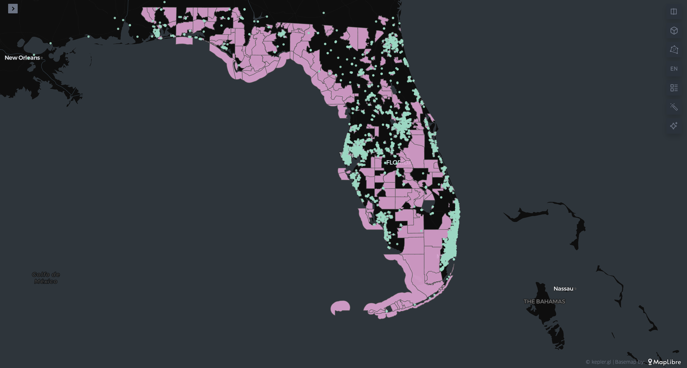

## Florida Pharmacy Desert Analysis
**A Health Equity Geospatial Case Study**

---

**Project Overview**
- Access to pharmacies is a cornerstone of healthcare equity. This project identifies and maps pharmacy deserts in Florida — census tracts where residents live beyond reasonable distance to a pharmacy.
- Using open public health datasets, I built an end-to-end data pipeline that combines:
- NPI pharmacy data (National Plan & Provider Enumeration System)
- Census TIGER/Line tracts (2024)
- CDC Social Vulnerability Index (SVI, 2022)
- HRSA Medically Underserved Areas (MUA/P)
- Python’s geospatial stack (pandas, geopandas, shapely)

---
## Methodology

1. **Data Engineering (ETL)**
   - Filtered 5,700+ Florida pharmacies from the NPI dataset
   - Cleaned and standardized addresses; geocoded to latitude/longitude
2. **Geospatial Integration**
   - Mapped pharmacies onto 5,160 Florida census tracts
   - Joined HRSA MUA/P polygons and CDC SVI scores
3. **Distance Modeling**
   - Computed nearest-pharmacy distance for every tract centroid
   - Classified deserts using thresholds:
     Urban → >1 mile
     Rural → >10 miles
4. **Equity Analysis**
   - Flagged deserts in high-SVI communities (≥0.75)
   - Measured overlap with federally designated MUA/P areas

---
## Key Findings
- 1,419 of 5,160 tracts (27.5%) in Florida are pharmacy deserts
- Urban deserts: 34% of tracts vs Rural deserts: 11%
- ### Equity lens:
  736 deserts are in high-SVI (most vulnerable) communities
  1,061 deserts overlap with HRSA Medically Underserved Areas
  Longest travel distances are concentrated in rural north Florida counties and the southern Everglades
- ### Geographic patterns:
  The rural north Florida Panhandle and the southern Everglades show the longest travel distances, often exceeding 10+ miles.
  Urban deserts appear in pockets of Miami, Orlando, and Tampa metro areas, where pharmacies may exist but are unevenly distributed relative to population need.
  
## Implications
- These findings highlight that pharmacy deserts are not limited to isolated rural zones but also majorly affects urban communities.
Expanding access could involve:
- Supporting new community pharmacies 
- Leveraging mobile clinics in rural gaps
- Prioritizing high-SVI communities and pharmacy deserts because those residents are the most at risk.

---
## Visualization
Pink tracts = pharmacy deserts
Green dots = active pharmacies
Rural north & south Florida show the largest coverage gaps

[Explore the interactive map here](https://kepler.gl/demo/map?mapUrl=https://dl.dropboxusercontent.com/scl/fi/lbsct5c3cyzprwkfxhxav/keplergl_2rbmloc.json?rlkey=0k9564kqimm58ul0iqmk62rni&dl=0)

---
## Tech Stack
 - Python → pandas, geopandas, shapely, pyproj
 - Visualization → [Kepler.gl](https://kepler.gl), [QGIS](https://qgis.org/en/site/), [Folium](https://pythonvisualization.github.io/folium/)
### Data Sources:
Using open public health datasets, I built an **end-to-end data pipeline** that combines:  
- [NPI pharmacy data](https://download.cms.gov/nppes/NPI_Files.html)  
- [NPI Download (CMS)](https://download.cms.gov/nppes/NPI_Files.html)  
- [Census TIGER/Line Tracts](https://www.census.gov/geographies/mapping-files/time-series/geo/tiger-line-file.html)  
- [CDC SVI 2022](https://www.atsdr.cdc.gov/placeandhealth/svi/data_documentation_download.html)  
- [HRSA MUA/P](https://data.hrsa.gov/data/download)  
---
## Why This Project Matters
**Pharmacy deserts highlight structural inequities in healthcare access. By combining ETL, geospatial analysis, and equity metrics, this project shows how data science can support public health decision-making.**

 - Demonstrates end-to-end project delivery — from raw data wrangling to geospatial joins, modeling, and visualization
 - Applies real healthcare datasets to produce actionable insights
 - Showcases data storytelling with clear findings and maps
